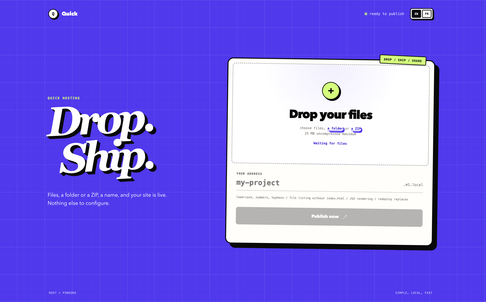

# Quick

*[Version française](./README.fr.md)*

Quick turns any folder, ZIP, or set of files into a live website in seconds:
drop them in, pick a name, and your site is instantly online at its own
address — no build step, no configuration, no servers to manage.

In the age of generative AI, we produce ever more pages, prototypes, and small
sites. Quick answers that need: hosting these ever-growing productions more
easily and faster than ever.

It is a Rust/Pingora implementation of the core idea behind
[Shopify Quick](https://shopify.engineering/quick): drop files and immediately
get a site available through its own subdomain with a single binary 




## Features

- transactional static-site replacement with rollback on failure;
- deployment homepage with file selection and drag-and-drop;
- English/French homepage selected through `Accept-Language`, with English as
  the fallback and a persistent manual language switcher;
- secure ZIP upload and extraction;
- homepage fully embedded in the executable, with no external asset required;
- hostname configuration with immediate access to the published URL;
- Pingora routing through `<site>.<domain>`;
- directory `index.html` support;
- `index.html` fallback for single-page applications;
- automatic file listing when no root `index.html` exists;
- browser-side React and Babel rendering for `.jsx` components;
- MIME type detection;
- rejection of symbolic links and path traversal attempts;
- local or S3-compatible storage with atomic releases.

Quick does not yet implement the database, file, AI, data warehouse,
WebSocket, or identity APIs described by Shopify.

## Getting Started

```sh
cargo build
cargo run -- serve
```

Open <http://localhost:8080>, select files, a directory, or a ZIP archive, then
choose a hostname. The site will be available at
`http://<hostname>.localhost:8080`.

When every file in a ZIP archive is stored under one root directory, Quick
automatically strips that directory. Archives are limited to 1,000 entries and
25 MiB of uncompressed content. Escaping paths, symbolic links, and encrypted
files are rejected.

All file types are accepted. When the root does not contain an `index.html`,
Quick displays a listing with a link to every uploaded file. Opening a `.jsx`
file renders its default React export. A file containing only a JSX expression
is also supported. JSX rendering loads React and Babel from public CDNs, so the
browser needs Internet access.

> **Because Quick supports JSX natively, Claude artifacts** — interactive React
> components generated directly by Claude — **can be saved as `.jsx` files and
> deployed without any build step.** Copy the artifact code, upload it, and it is
> immediately live under its own subdomain.

Command-line deployments remain available:

```sh
cargo run -- deploy examples/hello --site hello
```

Then open <http://hello.localhost:8080>. Modern browsers usually resolve
`*.localhost` to `127.0.0.1`. Otherwise:

```sh
curl -H 'Host: hello.localhost' http://127.0.0.1:8080/
```

Useful options:

```sh
quick serve --listen 0.0.0.0:8080 --sites-dir ./sites --base-domain quick.internal
quick deploy ./dist --site my-site --sites-dir ./sites
```

## Security

Quick serves plain HTTP without authentication or TLS. The whole server must be
placed behind an Identity-Aware Proxy (IAP) — such as
[Google Cloud IAP](https://cloud.google.com/iap) or
[oauth2-proxy](https://github.com/oauth2-proxy/oauth2-proxy) — whenever it is
exposed beyond a trusted network. Anyone who can reach the homepage can create
or replace a site.

## S3 Storage

Quick can store sites in AWS S3 or a compatible service such as MinIO,
Cloudflare R2, or Backblaze B2. Each deployment is written under an immutable
release prefix and published by replacing `current.json`.

Credentials use the standard AWS credential chain: `AWS_ACCESS_KEY_ID`,
`AWS_SECRET_ACCESS_KEY`, `AWS_SESSION_TOKEN`, profiles, and instance roles.

AWS S3:

```sh
quick serve \
  --storage s3 \
  --s3-bucket quick-sites \
  --s3-region eu-west-1
```

MinIO or another compatible endpoint:

```sh
AWS_ACCESS_KEY_ID=minio \
AWS_SECRET_ACCESS_KEY=minio-secret \
quick serve \
  --storage s3 \
  --s3-bucket quick-sites \
  --s3-region us-east-1 \
  --s3-endpoint http://127.0.0.1:9000 \
  --s3-path-style
```

The options are also available through `QUICK_STORAGE`, `QUICK_S3_BUCKET`,
`QUICK_S3_REGION`, `QUICK_S3_ENDPOINT`, `QUICK_S3_PREFIX`, and
`QUICK_S3_PATH_STYLE`. The bucket must exist before Quick starts.

Minimum IAM policy for the default prefix:

```json
{
  "Version": "2012-10-17",
  "Statement": [{
    "Effect": "Allow",
    "Action": ["s3:GetObject", "s3:PutObject"],
    "Resource": "arn:aws:s3:::quick-sites/quick/*"
  }]
}
```

Previous releases remain immutable in the bucket. Configure an S3 lifecycle
rule for `quick/sites/*/releases/` to delete them after the desired retention
period.

## Architecture

```text
quick deploy ./dist --site demo
             |
             v
 local: sites/demo/*
   or
 S3: quick/sites/demo/releases/<id>/*
             |
             v
demo.localhost -> Pingora -> static file
```

## Tests

```sh
cargo test
```

## Releases

Semantic tags matching `vX.Y.Z` trigger the GitHub Actions release workflow.
The tag version must match the version in `Cargo.toml`.

```sh
git tag v0.1.0
git push origin v0.1.0
```

After formatting, Clippy, and test checks, GitHub publishes a release with:

- Linux x86_64 as a `.tar.gz` archive;
- macOS Intel as a `.tar.gz` archive;
- macOS Apple Silicon as a `.tar.gz` archive;
- Windows x86_64 with `quick.exe` in a `.zip` archive;
- a SHA-256 checksum for each archive.

Each archive contains the executable and this README. The workflow starts every
binary on its native GitHub runner and verifies the embedded homepage before
publishing it.

The workflow can also be started manually from GitHub Actions. In that case,
it builds and stores the artifacts without creating a GitHub Release.

Every build checks that the homepage is embedded in the final executable. The
Linux job also runs an isolated copy of the executable from an empty directory
and verifies that the administration page works without companion files.
